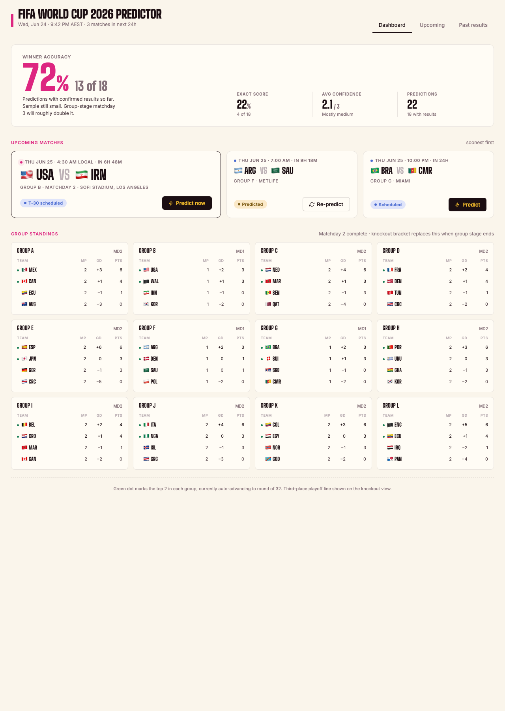
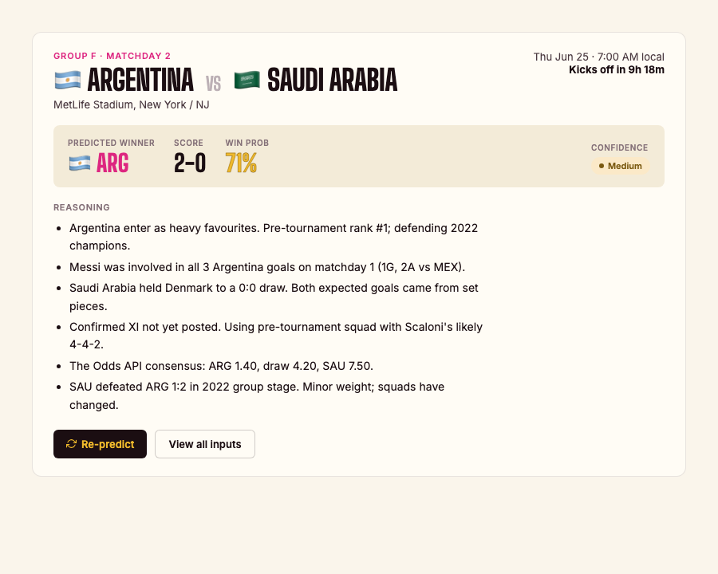
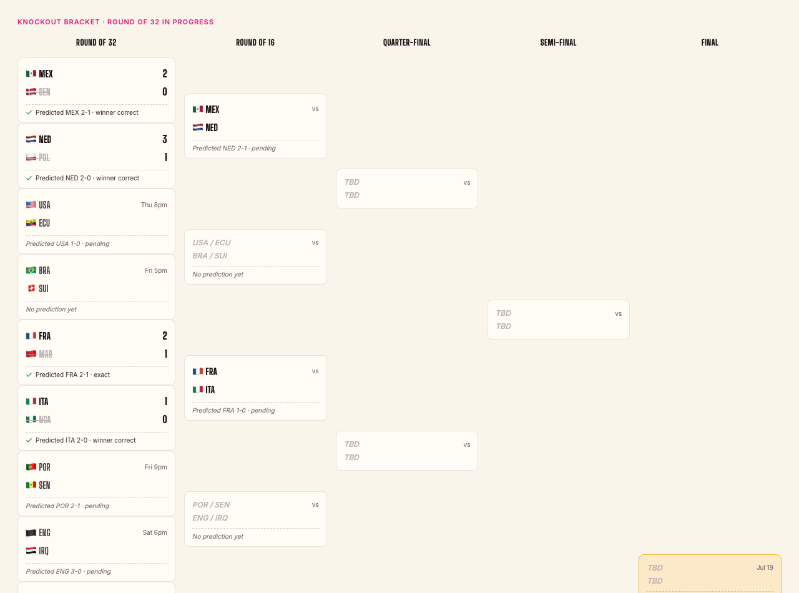

# Design references

Canonical visual references for the dashboard. These are the locked-in mockups the implementation should match.

- **DESIGN.md** (repo root) — the token specification: palette, typography, spacing, components.
- **PRODUCT.md** (repo root) — strategic brief: personality, anti-references, design principles.

## Mockups

Open these HTML files directly in a browser (`file://`) to see the design at intended size and fidelity. They load Big Shoulders Display and Inter from Google Fonts.

| File | Surface | Width |
| --- | --- | --- |
| [mockups/dashboard.html](mockups/dashboard.html) | Dashboard tab — track record, upcoming, group standings | 1280 |
| [mockups/prediction-card.html](mockups/prediction-card.html) | Full prediction card with reasoning bullets | 900 |
| [mockups/bracket.html](mockups/bracket.html) | Knockout bracket — R32 through final | 1280 |

## Screenshots

Static PNGs of each mockup. Useful for at-a-glance review in markdown clients (Github, IDEs).

### Dashboard



### Prediction card



### Knockout bracket



## Regenerating screenshots

Run from the repo root with Google Chrome installed at the standard macOS path:

```bash
CHROME="/Applications/Google Chrome.app/Contents/MacOS/Google Chrome"
SS=docs/design/screenshots
MOCK=docs/design/mockups

"$CHROME" --headless=new --disable-gpu --hide-scrollbars \
  --window-size=1280,1800 --virtual-time-budget=3000 \
  --screenshot="$SS/dashboard.png" "file://$PWD/$MOCK/dashboard.html"

"$CHROME" --headless=new --disable-gpu --hide-scrollbars \
  --window-size=900,720 --virtual-time-budget=3000 \
  --screenshot="$SS/prediction-card.png" "file://$PWD/$MOCK/prediction-card.html"

"$CHROME" --headless=new --disable-gpu --hide-scrollbars \
  --window-size=1280,950 --virtual-time-budget=3000 \
  --screenshot="$SS/bracket.png" "file://$PWD/$MOCK/bracket.html"
```

If a mockup changes meaningfully, regenerate its screenshot in the same commit.
